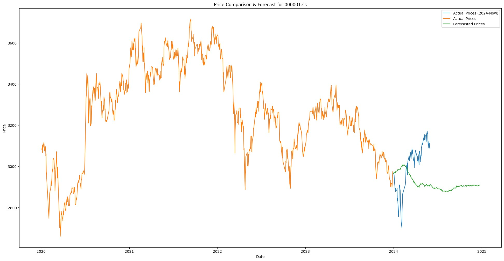
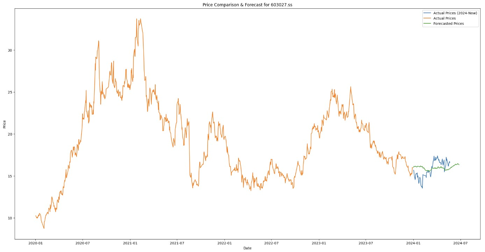
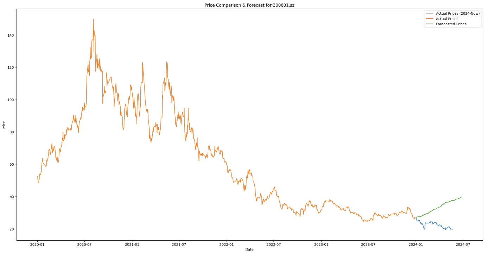

### Deployment
- 1. enviroment
	- install conda
`wget https://repo.anaconda.com/archive/Anaconda3-2024.02-1-Linux-x86_64.sh`

`sh Anaconda3-2024.02-1-Linux-x86_64.sh`
- 2. set conda
edit `~/.bashrc`, add `export PATH="/root/anaconda3/bin:$PATH"` at the end of .bashrc
	- then run
`source ~/.bashrc`
- 3. download timesfm

`wget https://github.com/google-research/timesfm/archive/refs/heads/master.zip`

`unzip timesfm-master.zip`

`mv timesfm-master timesfm`

`cd timesfm`
- 4. set environment according to the official Readme
`conda env create --file=environment_cpu.yml`
- 5. activate environment
`conda activate tfm_env`
- 6. install dependancies
`pip install -e .`
- 7. install yfinance (for predict for trading)
`conda install -c conda-forge yfinance`
- 8. acquire huggingface Access Tokens (for predict for trading)
create a new Access Token with type WRITE in https://huggingface.co/settings/tokens 
apply this later in the code:
`login("copy your token")`
to have access `google/timesfm-1.0-200m`
- 9. start predicting
`python timesfm.py`

### Results
All we have to do is to set parameters and feed a time series as input into the predictor.
a fews tests are done with timesfmhs.py, here are three plots
- 

- 

- 

### Test with Sinus function
simply run tutorial_model.py